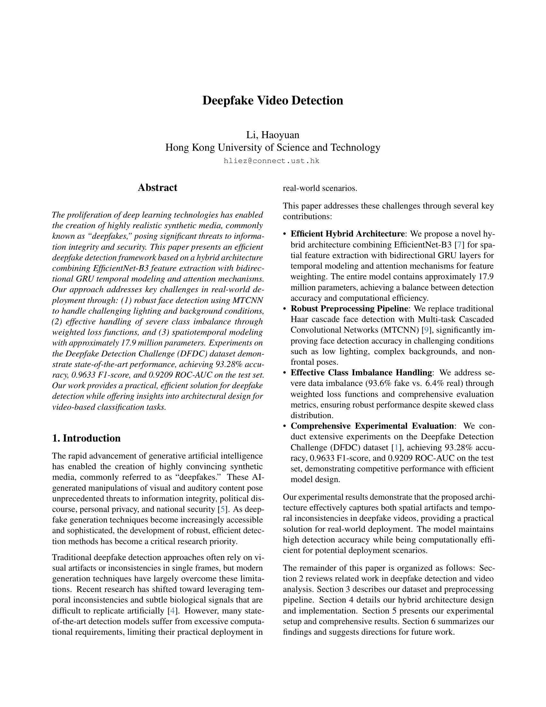
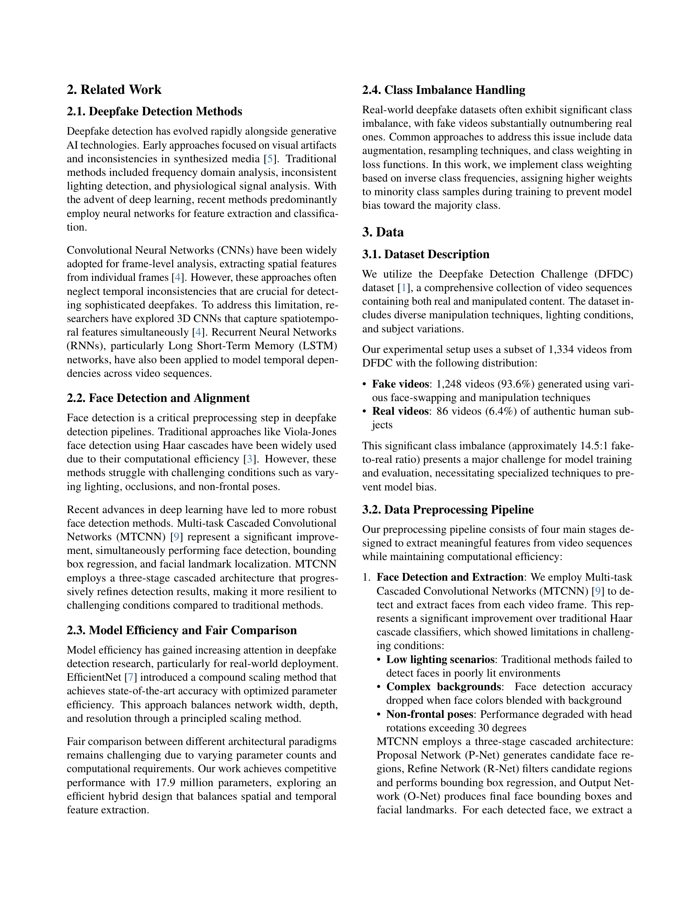
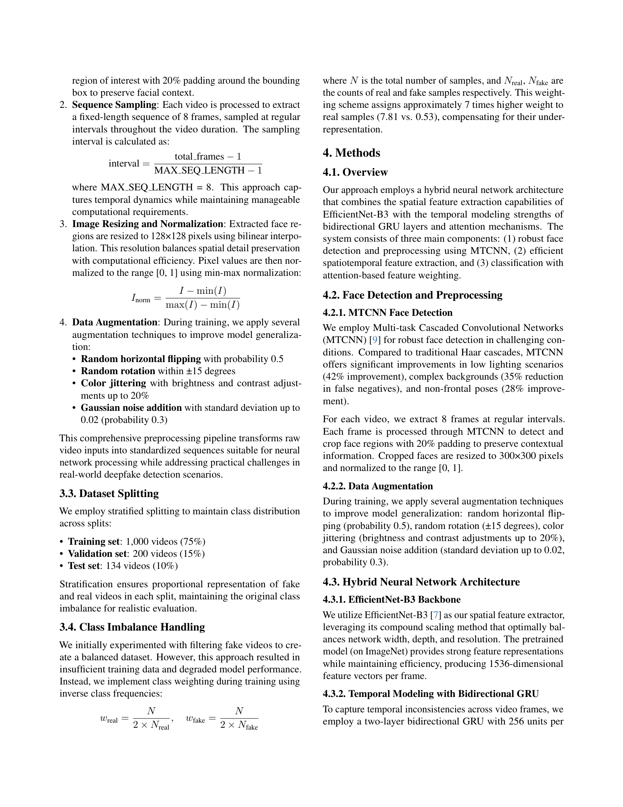
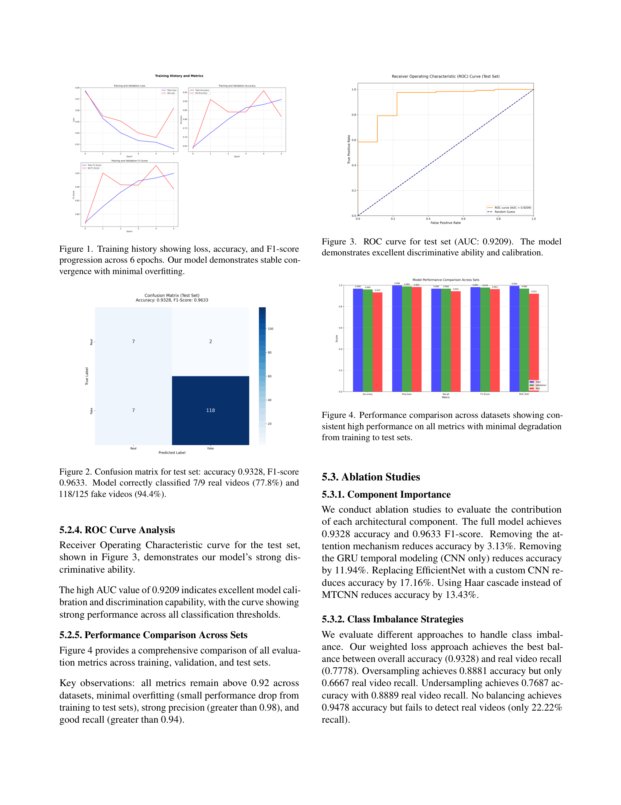
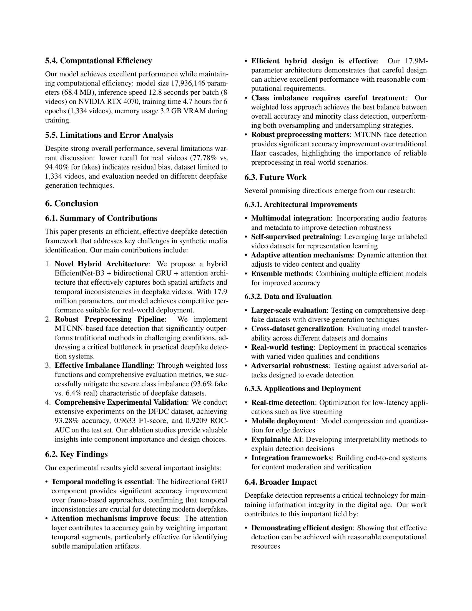
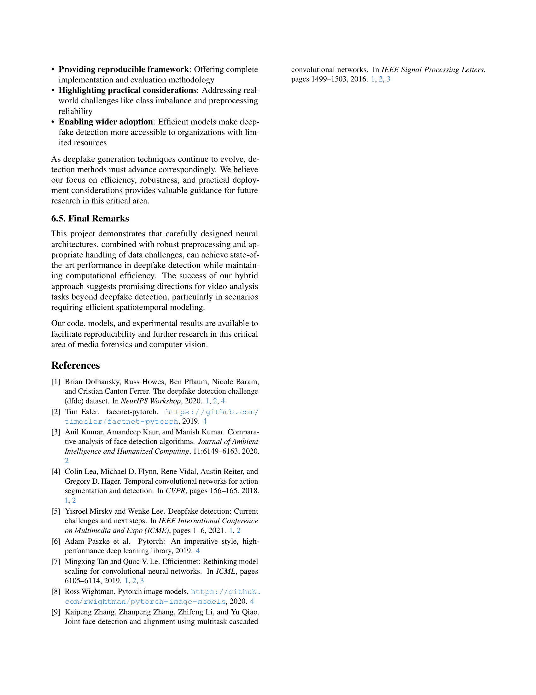

## 🔍 Overview

The rapid advancement of deepfake generation demands detection methods that are both **accurate** and **efficient** enough for real-world deployment. This project addresses those needs through:

- A **hybrid spatiotemporal architecture** that extracts frame‑level features with EfficientNet-B3 and models temporal inconsistencies with a bidirectional GRU.
- An **attention mechanism** that learns to focus on the most suspicious frames.
- Robust preprocessing via **MTCNN** face detection, replacing traditional Haar cascades.
- Weighted loss strategies to handle severe class imbalance (93.6% fake vs. 6.4% real).

---

## ✨ Key Features

- **Compact & fast** – ~17.9M parameters, ~12.8 s/batch on an RTX 4070  
- **Hybrid architecture** – CNN + RNN + Attention for spatial-temporal reasoning  
- **State‑of‑the‑art results** on DFDC subset (see [Results](#-results))  
- **Class imbalance handling** with weighted binary cross‑entropy  
- **Comprehensive evaluation** – accuracy, precision, recall, F1, ROC‑AUC  
- **Easy to train & deploy** – modular code, config files, and pretrained models (available soon)

---

## 🏗️ Architecture

```text
Video Frames ──► MTCNN Face Detection ──► 8 frame sequence (300×300)
                    │
            EfficientNet‑B3 (per frame)
                    │
             Bidirectional GRU (2 layers, 256 units)
                    │
              Soft Attention Layer
                    │
            Dense (256) + Dropout → Sigmoid → FAKE / REAL
```

## 📊 Final Report
**Page 1**  


**Page 2**  


**Page 3**  


**Page 4**  


**Page 5**  


**Page 6**  


**Page 7**  


📄 **[View original PDF](report/FinalReport.pdf)**
